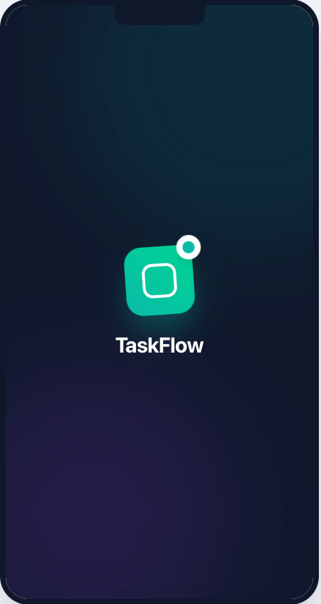
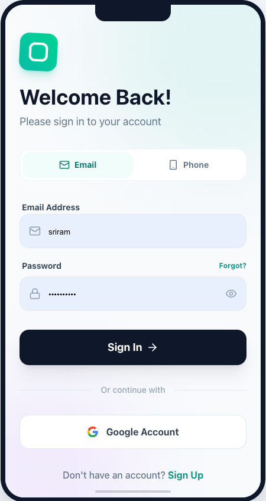
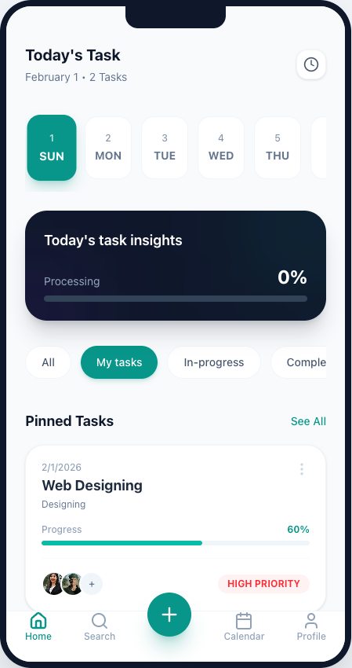
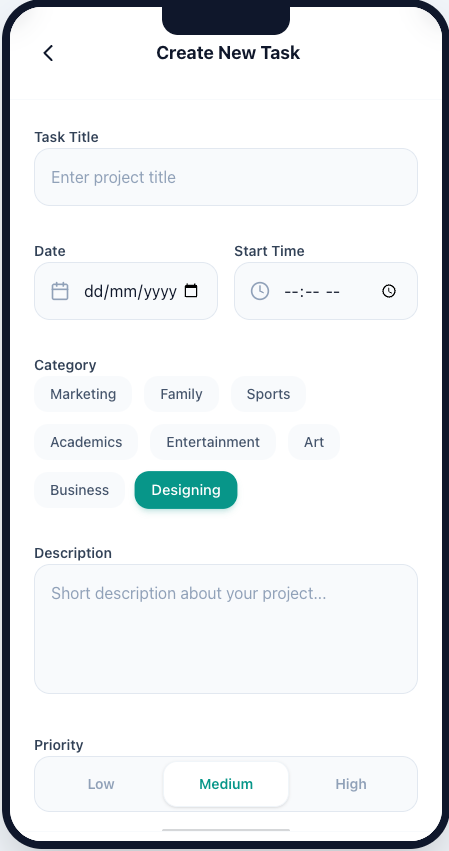
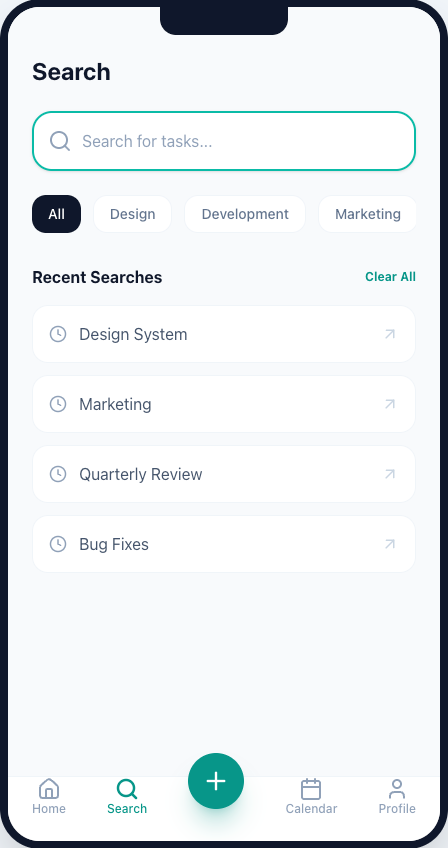
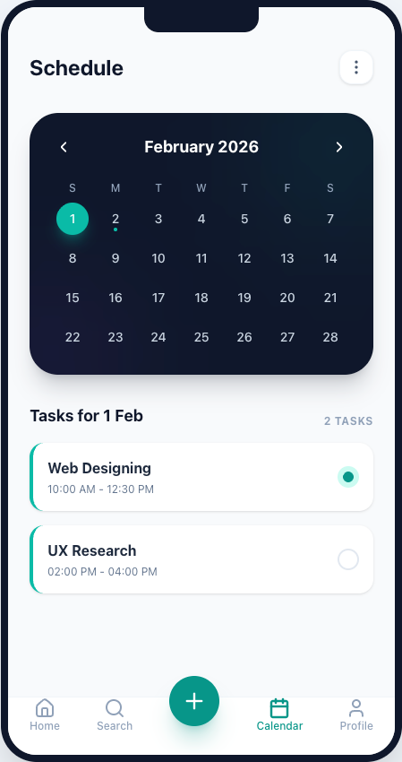
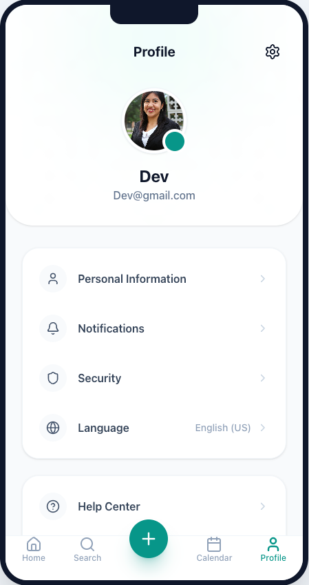
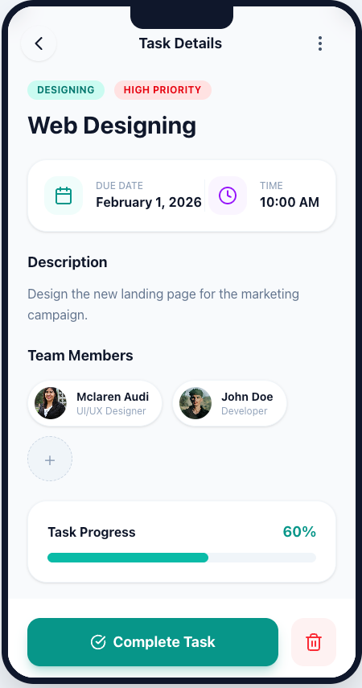
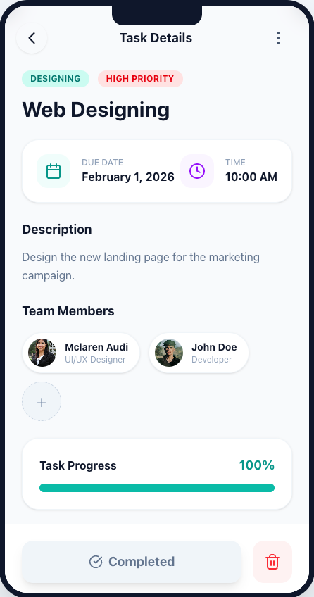

<div align="center">

# 📱 TaskFlow

### _Your Beautiful, Modern Task Management Companion_

> A stunning, mobile-first task management app built with cutting-edge web technologies. Manage tasks, track progress, and collaborate with your team — all in a gorgeous interface that feels like a native mobile app.



[](https://reactjs.org/)
[](https://www.typescriptlang.org/)
[](https://github.com/pmndrs/zustand)
[](https://tailwindcss.com/)
[](https://vitejs.dev/)

[Live Demo](#) • [Features](#-features) • [Installation](#-quick-start) • [Screenshots](#-app-showcase)

</div>

---

## 🌟 Why TaskFlow?

TaskFlow isn't just another task manager — it's a **beautifully crafted experience** that combines modern design with powerful functionality. Built from the ground up with React and TypeScript, it offers:

- 🎨 **Stunning UI** — Glassmorphism effects, smooth animations, and a delightful user experience
- 📱 **Mobile-First** — Feels like a native app with no visible scrollbars and fluid transitions
- 💾 **Smart Persistence** — Your data is automatically saved and synced to local storage
- ⚡ **Lightning Fast** — Powered by Vite and optimized for performance
- 🎯 **Zero Learning Curve** — Intuitive interface that anyone can use immediately

---

## ✨ Features

### 🎯 **Task Management Excellence**

- ✅ Create, edit, delete, and complete tasks with ease
- 🏷️ Organize by categories (Marketing, Family, Sports, Academics, etc.)
- 🎨 Priority levels (High, Medium, Low) with visual color coding
- 📊 Progress tracking with beautiful progress bars
- 👥 Team collaboration with assignee management

### 📅 **Smart Organization**

- 🗓️ Interactive calendar view with monthly navigation
- 📍 Calendar strip for quick date selection
- 🔍 Powerful search with category filters
- ⏱️ Time-based scheduling with start/end times
- 📝 Detailed task descriptions and notes

### 💫 **Modern Experience**

- 🎭 Smooth animations powered by Motion/React
- 🔔 Toast notifications for instant feedback
- 🌐 React Router for seamless navigation
- 💾 Zustand state management for optimal performance
- 🎨 Glassmorphism and modern design patterns
- 📱 No scrollbars — pure native app feel

---

## 📸 App Showcase

<div align="center">

### 🔐 Authentication & Onboarding



### 🏠 Dashboard & Home



### ➕ Create & Edit Tasks



### 🔍 Search & Filter



### 📅 Calendar & Schedule



### 👤 Profile & Settings



### 📝 Task Details

<table>
  <tr>
    <td></td>
    <td></td>
  </tr>
</table>

</div>

---

## 🚀 Quick Start

### Prerequisites

- Node.js 16+ and npm

### Installation

```bash
# Clone the repository
git clone https://github.com/SriramDivi1/TaskFlow.git
cd TaskFlow

# Install dependencies
npm install

# Start development server
npm run dev
```

🎉 Open [http://localhost:3000](http://localhost:3000) and start managing your tasks!

---

## 🛠️ Tech Stack

### Core

- **React 18** — Latest React with hooks and concurrent features
- **TypeScript** — Type-safe development
- **Vite** — Next-generation frontend tooling

### State & Routing

- **Zustand** — Lightweight state management with persistence
- **React Router v7** — Client-side routing with browser history

### Styling & UI

- **Tailwind CSS** — Utility-first CSS framework
- **Motion (Framer Motion)** — Smooth animations and transitions
- **Lucide React** — Beautiful icon library

### Developer Experience

- **date-fns** — Modern date utility library
- **Sonner** — Beautiful toast notifications
- **ESLint** — Code quality and consistency

---

## 📦 Project Structure

```
TaskFlow/
├── src/
│   ├── components/           # React components
│   │   ├── Layout.tsx        # App layout wrapper
│   │   ├── BottomNav.tsx     # Bottom navigation
│   │   ├── HomeScreen.tsx    # Dashboard view
│   │   ├── CreateTaskScreen.tsx
│   │   ├── TaskDetailScreen.tsx
│   │   ├── SearchScreen.tsx
│   │   ├── CalendarScreen.tsx
│   │   ├── ProfileScreen.tsx
│   │   └── ui/               # Reusable UI components
│   ├── store.ts              # Zustand store with persistence
│   ├── types.ts              # TypeScript type definitions
│   ├── data/                 # Mock data
│   ├── App.tsx               # Root component with routing
│   └── main.tsx              # Entry point
├── screenshots/              # App screenshots
└── README.md                 # You are here!
```

---

## 🎨 Key Features Explained

### 🔄 **State Management with Zustand**

```typescript
// Centralized store with automatic persistence
const tasks = useStore((state) => state.tasks);
const addTask = useStore((state) => state.addTask);
```

- Automatic localStorage sync
- Custom Date serialization
- No prop drilling
- Type-safe actions

### 🧭 **Smart Navigation**

- Browser back/forward button support
- Meaningful URLs
- Conditional bottom nav visibility
- Smooth page transitions

### 💾 **Data Persistence**

- Auto-save to localStorage
- Survives page refreshes
- State hydration on app load
- No data loss

---

## 🎯 Use Cases

Perfect for:

- 📚 Students managing assignments and study schedules
- 💼 Professionals tracking work projects
- 👨‍👩‍👧‍👦 Families organizing household tasks
- 🎯 Teams collaborating on projects
- 📅 Anyone who wants beautiful task management

---

## 🤝 Contributing

Contributions are welcome! Feel free to:

- 🐛 Report bugs
- 💡 Suggest new features
- 🔧 Submit pull requests
- ⭐ Star this repository

---

## 📄 License

This project is open source and available under the [MIT License](LICENSE).

---

## 👨‍💻 Author

**Sriram Divi**  
GitHub: [@SriramDivi1](https://github.com/SriramDivi1)

---

<div align="center">

### 🌟 Love TaskFlow? Give it a star! ⭐

**Made with ❤️ using React & TypeScript**

[⬆ Back to Top](#-taskflow)

</div>
